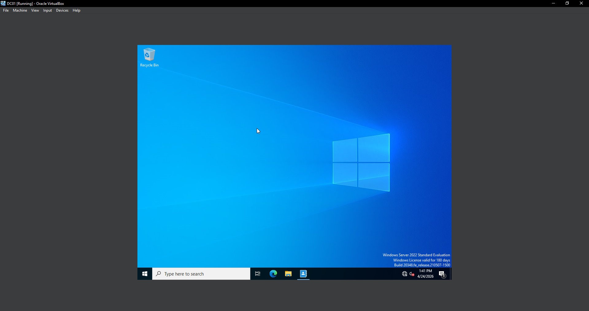
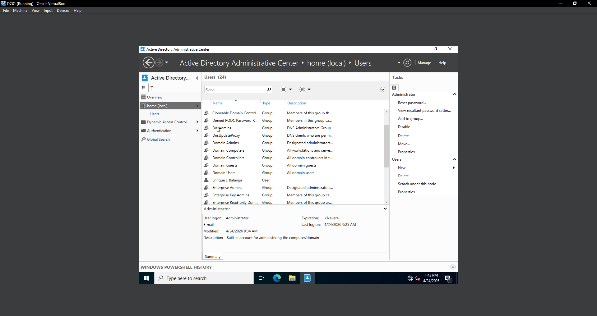
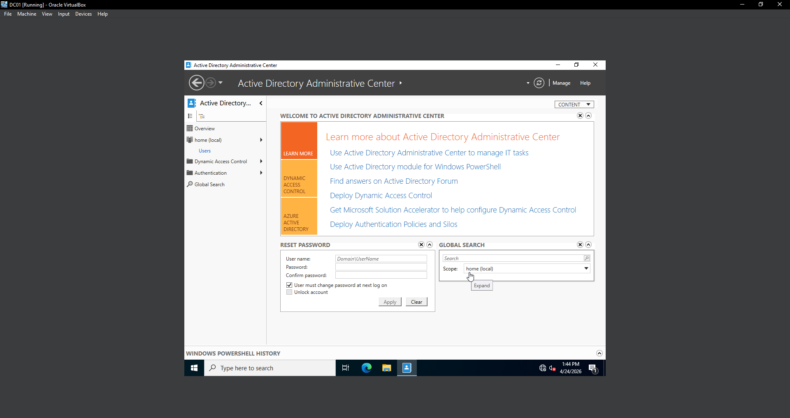
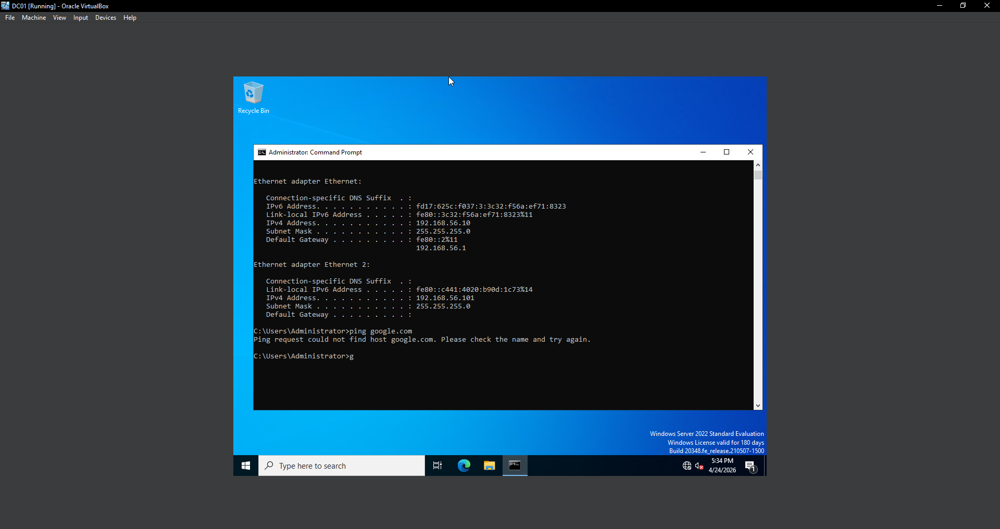

# Home Lab: Active Directory Domain Controller

Built and documented a virtualised Windows Server network — an Active Directory
domain controller running on Windows Server 2022, with an Ubuntu client, deployed
entirely in VirtualBox on a home PC.

## Topology
INTERNET
                    │
                 NAT NIC
                    │
              ┌─────┴─────┐
              │    DC01    │
              │ Win Server │
              │  AD DS     │
              │  DNS       │
              └─────┬─────┘
                    │
            Host-only LAN (192.168.56.0/24)
                    │
              ┌─────┴─────┐
              │  UBUNTU01  │
              │  Client    │
              └────────────┘
              ## Environment

| Component | Spec |
|---|---|
| Host | AMD Ryzen 5 3600, 16GB RAM, RX 6600 XT |
| Hypervisor | Oracle VM VirtualBox |
| Domain Controller | Windows Server 2022 Standard |
| Client | Ubuntu Desktop 24.04 LTS |
| Domain | home.lab |
| Networking | NAT + Host-only |

## What I built

**Day 1 — Linux foundation.** Stood up an Ubuntu VM, verified networking
(static IP via NAT, internet connectivity), updated packages, and enabled SSH.
Full write-up: [day1-setup.md](day1-setup.md)

**Day 2 — Active Directory.** Installed the AD DS role on Windows Server,
promoted it to a domain controller for `home.lab`, confirmed DNS was
configured automatically, and created a domain user account.
Full write-up: [day2-active-directory.md](day2-active-directory.md)

## Troubleshooting

### Incident: Domain Controller Administrative Access Recovery

Lost access to the local Administrator account after forgetting the
password, with no snapshot to fall back on. Recovered the VM using an
offline WinPE-based reset. During recovery, ran into filesystem
redirection caused by using 32-bit PowerShell, diagnosed the discrepancy
between `System32` and `SysWOW64`, restored the original system binary,
verified normal login, and took a snapshot afterwards for future recovery.

Full recovery procedure

1. Booted from Windows Server 2022 install media, opened a command prompt
   at Setup (`Shift+F10`).
2. Used `diskpart` → `list volume` to confirm the real Windows partition —
   WinPE assigns its own drive letters, which don't match the installed OS.
3. Swapped `utilman.exe` for `cmd.exe`: move D:\windows\system32\utilman.exe D:\windows\system32\utilman.exe.bak
copy D:\windows\system32\cmd.exe D:\windows\system32\utilman.exe
4. Rebooted normally, clicked Ease of Access on the login screen — launched
   a SYSTEM-level prompt instead of the accessibility panel.
5. Reset the password: `net user Administrator NewPassword`
6. Restoring `utilman.exe` afterward failed twice before working:
   - `copy /y` is `cmd.exe` syntax, not valid in PowerShell.
   - The correct `Copy-Item` syntax still failed because the shell was
     32-bit PowerShell — on 64-bit Windows, 32-bit processes get silently
     redirected from `System32` to `SysWOW64` (WOW64 File System
     Redirection), so it couldn't see the file sitting in the real
     `System32`. Fixed by using native 64-bit PowerShell instead.

### Incident: No internet connectivity after reboot — misconfigured NIC binding

`ping 8.8.8.8` failed with "General failure" — a routing issue, not DNS
(pinging a raw IP rules out name resolution as the cause). Diagnosed by
cross-referencing each NIC's MAC address in `ipconfig /all` against
VirtualBox's adapter settings: a static Host-only-style IP had been
assigned to the adapter actually wired to NAT, leaving it with no route
out. Fixed by returning that adapter to DHCP so it could pull a real
gateway from NAT. Verified with a clean 4/4 ping, 0% loss.

### Incident: DC couldn't resolve its own domain — DNS misconfiguration

`dcdiag /test:dns` failed with "all DNS servers are invalid" and no host
records found for the DC. Root cause: the DC's adapter was using the home
router's IP (via DHCP) as its DNS server — a domain controller has to
resolve its own zone, so it must point to itself (`127.0.0.1`) or another
DC, never an external resolver. Fixing that surfaced two more issues in
sequence: the adapter's IP was still dynamic (DCs should be fully static),
and the DNS service itself had silently stayed stopped from an earlier
failed restart attempt. Resolved all three, layer by layer, verifying with
`dcdiag /test:dns` after each fix — final result came back completely
clean.

## Skills demonstrated

- System administration (Windows Server, Active Directory Domain Services)
- Linux fundamentals (Ubuntu install, package management, SSH)
- Networking (NAT vs Host-only adapters, static/DHCP config, gateway routing, DNS)
- Identity and access management (domain user creation, AD Administrative Center)
- Windows internals (WOW64 file system redirection, offline password recovery)
- Systematic troubleshooting (isolating root cause layer by layer before applying a fix)
- Technical documentation

## Roadmap

- [x] VirtualBox environment
- [x] Windows Server 2022
- [x] AD DS
- [x] DNS
- [x] Domain user
- [x] Ubuntu client
- [x] Network troubleshooting
- [ ] Windows domain client
- [ ] OU architecture and security groups
- [ ] Group Policy
- [ ] File server / SMB shares with NTFS permissions
- [ ] PowerShell automation
- [ ] Security hardening
